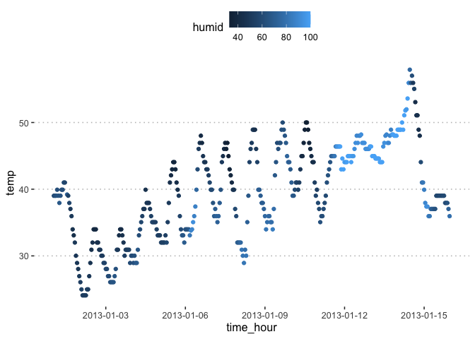

p8105_hw1_yq2378
================
Qi Yumeng
2023-09-16

# Problem 1

The dataset has 358 observations representing hourly measurements and 15
variables. According to help document, there are 5 time related
variables like `year`, `month`, `day`, `hour` and `time_hour` (Date and
hour of the recording as a POSIXct date). `origin` is the weather
station. `temp`,`dewp` is temperature and dewpoint in F.`humid` is
relative hunmidity. `wind_dir`, `wind_speed`, `wind_gust` is
respectively wind direction (in degrees), speed and gust speed (in mph).
`precip` is precipitation in millibars. `visib` is visbility in miles.

The mean temperature is around 39.58 F.

``` r
x = c("moderndive", "ggplot2","ggpubr", "tidyverse")
lapply(x, require, character.only = TRUE)
```

    ## Loading required package: moderndive

    ## Loading required package: ggplot2

    ## Loading required package: ggpubr

    ## Loading required package: tidyverse

    ## ── Attaching packages ─────────────────────────────────────── tidyverse 1.3.0 ──

    ## ✔ tibble  3.2.1     ✔ dplyr   1.1.3
    ## ✔ tidyr   1.3.0     ✔ stringr 1.5.0
    ## ✔ readr   2.1.4     ✔ forcats 1.0.0
    ## ✔ purrr   1.0.2

    ## ── Conflicts ────────────────────────────────────────── tidyverse_conflicts() ──
    ## ✖ dplyr::filter() masks stats::filter()
    ## ✖ dplyr::lag()    masks stats::lag()

    ## [[1]]
    ## [1] TRUE
    ## 
    ## [[2]]
    ## [1] TRUE
    ## 
    ## [[3]]
    ## [1] TRUE
    ## 
    ## [[4]]
    ## [1] TRUE

``` r
data("early_january_weather")
```

``` r
# the size of the dataset (using nrow and ncol)
nrow(early_january_weather)
```

    ## [1] 358

``` r
ncol(early_january_weather)
```

    ## [1] 15

``` r
# the mean temperature
mean(early_january_weather$temp)
```

    ## [1] 39.58212

Over time, both temperature and humidity tend to increase. Of course,
there are daily fluctuations, with temperatures typically peaking in the
afternoon and dropping in the morning and at night.

``` r
(p = ggplot(early_january_weather, 
            aes(x = time_hour, y =temp,color = humid))+geom_point() +
     scale_x_datetime(breaks = "3 day")+ 
                      theme_pubclean())
```

<!-- -->

``` r
ggsave("output_plot1.png", plot = p, dpi = 300)
```

    ## Saving 7 x 5 in image

# Problem 2

``` r
# Set a seed for reproducibility
set.seed(2378)
# Create a random sample of size 10 from a standard Normal distribution
random_sample = rnorm(10, mean = 0, sd = 1)
# Create a logical vector indicating whether elements of the sample are greater than 0
logical_vector = random_sample > 0
# Create a character vector of length 10
character_vector = c("columbia", "168", "HYLO", "Mailman", "School", "COMOD", "Public", "Health", "AA", "Hammer")
# Create a factor vector of length 10 with 3 different factor "levels"
factor_vector = factor(sample(letters[1:3], 10, replace = TRUE))

# Create the data frame
df_problem2 = data.frame(
  RandomSample = random_sample,
  LogicalVector = logical_vector,
  CharacterVector = character_vector,
  FactorVector = factor_vector
)
# Print the data frame
print(data_frame)
```

    ## function (...) 
    ## {
    ##     deprecate_warn("1.1.0", "data_frame()", "tibble()")
    ##     tibble(!!!quos(...))
    ## }
    ## <bytecode: 0x7fcd9ed64660>
    ## <environment: namespace:tibble>

When taking the mean of each variable, we get two warnings for
`CharacterVector` and `FactorVector`. The other two variables,
`RandomSample` and `LogicalVector` have means of their own.

``` r
df_problem2 %>% pull(RandomSample) %>% mean()
```

    ## [1] -0.2073361

``` r
df_problem2 %>% pull(LogicalVector) %>% mean()
```

    ## [1] 0.4

``` r
df_problem2 %>% pull(CharacterVector) %>% mean()
```

    ## Warning in mean.default(.): argument is not numeric or logical: returning NA

    ## [1] NA

``` r
df_problem2 %>% pull(FactorVector) %>% mean()
```

    ## Warning in mean.default(.): argument is not numeric or logical: returning NA

    ## [1] NA

The logical vector can be converted to numeric values following the
mapping of True = 1 and False = 0

The character vector can be only converted to numeric values when the
element is coated as character like “168”. Otherwise, there will only be
warnings and NAs.

The factor vector can be converted to numeric values based on the levels
of the factor. The mapping is a = 1, b = 2 and c = 3

``` r
as.numeric(df_problem2$LogicalVector)
```

    ##  [1] 0 0 1 0 0 1 1 1 0 0

``` r
as.numeric(df_problem2$CharacterVector)
```

    ## Warning: NAs introduced by coercion

    ##  [1]  NA 168  NA  NA  NA  NA  NA  NA  NA  NA

``` r
as.numeric(df_problem2$FactorVector)
```

    ##  [1] 2 2 1 2 3 1 2 2 3 2
